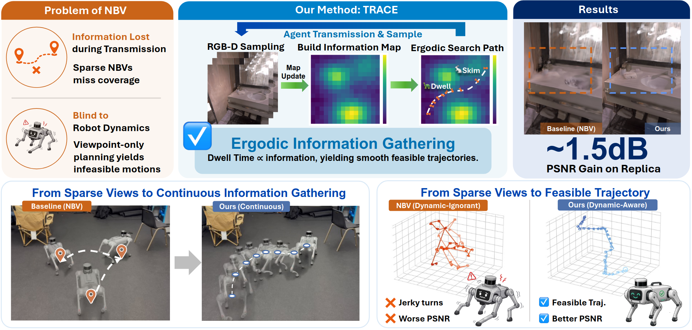

<div align="center">
  <h1>TRACE: Ergodic Trajectory Optimization for Active Scene Reconstruction</h1>
  <p>
    <a href="https://arxiv.org/abs/2608.02304"></a>&nbsp;
    <a href="LICENSE"></a>&nbsp;
    <a href="https://www.python.org/"></a>&nbsp;
  </p>

  [**Ziyue Zheng**](https://zhengtianjin.github.io/)¹\*, [**Linli Shi**](https://indexss.github.io/)¹\*, **Bingkun He**¹, [**Wen Jiang**](https://jiangwenpl.github.io/)², [**Ziyun Wang**](https://ziyunclaudewang.github.io/)¹†

  <sub>¹Johns Hopkins University &nbsp;&nbsp; ²University of Pennsylvania &nbsp;&nbsp;&middot;&nbsp;&nbsp; \*Equal contribution &nbsp;&nbsp;†Corresponding author</sub>
</div>

Official code release for **TRACE: Ergodic Trajectory Optimization for Active Scene Reconstruction**.

## 📖 Overview



TRACE uses a time-varying, footprint-aware ergodic planner for active reconstruction. Sensor-footprint overlap depletes already-covered information, encouraging the trajectory to cover informative surface regions instead of repeatedly observing the same geometry.

```text
Replica scene
    │ RGB-D observations
    ▼
voxel state + Gaussian map ──▶ information field φ
    ▲                                        │
    │                                        ▼
incremental mapping ◀── camera path ◀── TRACE kernel-ergodic planner
```

## 🎬 Video

https://github.com/user-attachments/assets/b49b87f0-8e85-4e89-9ad1-4859d53050bb

## 🔎 Visualization

Top-down Gaussian-splatting reconstruction with the executed camera trajectory overlaid, for each Replica scene, 300 s missions. You can watch the experiment videos on Replica [here](examples/trace-video).

We also provide one full experiment result (300 s time budget) under `examples/trace`.

## 🚀 Quickstart


**We test TRACE on Ubuntu 24.04 with RTX 5090, CUDA 12.8.**

> **Note**: Habitat-Sim is built from source, and 2D Gaussian Splatting requires compiling custom CUDA kernels. Expect to resolve some machine-specific build issues.


Run office0 with a 300 s time budget.

```bash
# 1. Create the environment and build CUDA dependencies. 
bash scripts/install.sh
conda activate trace

# 2. Download Office 0 from Replica.
bash data/replica_example.sh

# 3. Reconstruction (300 s) -> eval
python scripts/run_experiment.py \
  --scene office0 \
  --exp-id trace_office0_300s \
  --budget 300 \
  --generate-eval-poses

# 4. Office 0 full run matching our setup, to reproduce the reported result.
python scripts/run_experiment.py \
  --scene office0 \
  --exp-id trace_office0_horizons \
  --horizon-budget-file config/horizon_budget.yaml \
  --generate-eval-poses
```
---

## 📊 Evaluation

> Horizon counts vary across setups. On ours, within a 300 s time budget, `ctrl_reg_pose: 5.0` completes ~140 horizons and `ctrl_reg_pose: 1.0` completes ~100 horizons. We also recorded the average horizon count for each scene under our setup in `config/horizon_budget.yaml`.

To run on all test scenes, download all Replica scenes:
```bash
bash data/replica_download.sh
```

Run all test scenes:
```bash
python scripts/run_experiment.py \
  --scene office0 office2 office3 office4 room0 room1 room2 hotel0 \
  --exp-id trace_replica_300s \
  --budget 300 \
  --generate-eval-poses
```

To reproduce our reported runs, use a fixed number of horizons per
scene. 
```bash
python scripts/run_experiment.py \
  --scene office0 office2 office3 office4 room0 room1 room2 hotel0 \
  --exp-id trace_replica_horizons \
  --horizon-budget-file config/horizon_budget.yaml \
  --generate-eval-poses
```

Additional options:

| Option | Purpose |
|---|---|
| `--with-gui` | Show the live viewer during the mission. Due to GUI rendering, the task time will increase. Turn it off when evaluating.|
| `--skip-mission` | Re-evaluate an existing experiment |
| `--skip-render-eval` | Skip the redering evaluation |

## Acknowledgements

This work was supported in part by funding from the
Johns Hopkins Data Science and AI Institute.

Our code is partially based on [ActiveGS](https://github.com/dmar-bonn/active-gs) and [Gaussian Surfels](https://github.com/turandai/gaussian_surfels). Thanks to the authors for their great work.

## Citation
```bibtex
@misc{zheng2026traceergodictrajectoryoptimization,
      title={TRACE: Ergodic Trajectory Optimization for Active Scene Reconstruction}, 
      author={Ziyue Zheng and Linli Shi and Bingkun He and Wen Jiang and Ziyun Wang},
      year={2026},
      eprint={2608.02304},
      archivePrefix={arXiv},
      primaryClass={cs.RO},
      url={https://arxiv.org/abs/2608.02304}, 
}
```

## License

MIT — see [LICENSE](LICENSE).

<div align="center">
  <br>
  <a href="https://github.com/spikelab-jhu">
    
  </a>
  <p><sub>Developed by <strong>SPIKE Lab</strong>, Johns Hopkins University</sub></p>
</div>
